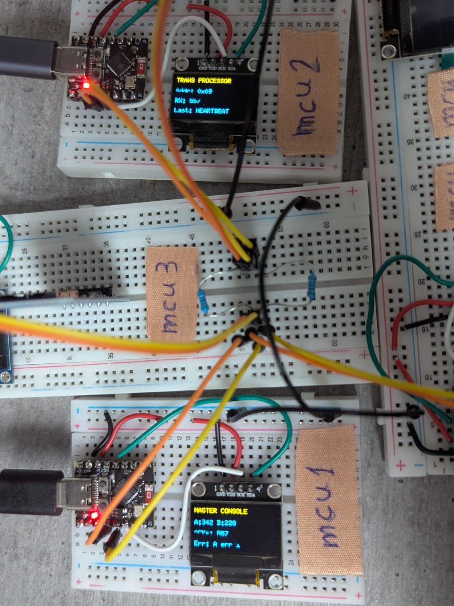

# Devlog

---

## Phase 1.5 — SharedBus Class: Encapsulation and ISR-Safe Receive
*Goal: extract shared bus boilerplate into a shared library; fix ISR-unsafe OLED calls in onReceive*

### What we built
- `SharedBus` class in `shared/libs/shared_bus/` — encapsulates TwoWire(0) entirely
- `beginMaster()` / `beginSlave(address)` replace raw TwoWire init in every main.cpp
- `BusError send(target, message)` wraps the 3-step TwoWire dance with a typed error return
- `poll(buf, len)` replaces the `onReceive` callback pattern — safe to call from `loop()`
- No raw `TwoWire`, `Wire.h`, or pin numbers remain in any main.cpp

### Design decisions

**BusError enum over bool**
`endTransmission()` returns 5 distinct codes. A bool collapses `NOT_FOUND`, `BUS_FAULT`,
and `TIMEOUT` into a single failure, making diagnostics harder. `BusError` preserves the
distinction so callers can log or display the specific failure reason.

**poll() over onReceive callback**
The original MCU #2 code called `oled.showStatus()` directly inside `onReceive`. That
callback runs in interrupt context — calling U8g2 software I2C (bit-banging GPIOs) from
inside an active I2C interrupt is a known deadlock/corruption risk on ESP32.
The fix: `onReceive` ISR only reads raw bytes into an internal `_rxBuf` (no I2C, no heap,
no blocking). `poll()` is called from `loop()` — safe for OLED updates, Serial, and
anything else. The cost is a small polling delay (~10ms) which is acceptable for this
use case.

**Static _instance pointer**
Arduino's `onReceive` requires a plain C function pointer — no lambdas, no member
function pointers. A static `_instance` pointer lets the static ISR reach the live
TwoWire and buffer. One SharedBus per MCU is the intended constraint.

### Verified pass criteria
- MCU #1 serial: `[MCU1] SEND OK — MCU2 acknowledged` ✅
- MCU #2 serial: `[MCU2] Received: HELLO FROM MCU1` ✅
- No raw TwoWire or pin numbers in either main.cpp ✅
- shared_bus picked up automatically by PlatformIO LDF via lib_extra_dirs ✅

### Key learnings
- `endTransmission()` return codes map cleanly to typed errors — worth modelling explicitly
- ISR callbacks on Arduino are not safe for I2C or any blocking operation; buffer-and-poll
  is the standard workaround
- Static singleton pattern is the only practical way to bridge C-style callbacks to C++ objects
  in the Arduino framework

---

## Phase 1.5 — Dual I2C Bus Fix: OLED + Shared Bus Simultaneously
*Goal: run OLED display and inter-MCU shared bus at the same time on each MCU*

### What we built
- Migrated OLED library from Adafruit SSD1306 (hardware I2C) to U8g2 (software I2C)
- Both MCU #1 (master) and MCU #2 (slave) now run OLED and shared bus simultaneously
- U8g2 bit-bangs I2C in software on GPIO3/GPIO10, leaving TwoWire(0) free for shared bus

### What went wrong and how it was fixed

**1. TwoWire(1) silently fails on ESP32-C3**
Initial approach was to assign OLED to TwoWire(1) and shared bus to TwoWire(0).
Both MCUs crashed at boot with repeated `[Wire.cpp:526] write(): NULL TX buffer pointer`.
Root cause: ESP32-C3 has `SOC_I2C_NUM = 1` — only one hardware I2C peripheral.
`TwoWire(1).begin()` calls `i2cInit(1, ...)` which returns `ESP_ERR_INVALID_ARG` since
`1 >= SOC_I2C_NUM`. The buffer is never allocated. No error is surfaced to Arduino code.
The comment in soc_caps.h even says "have 2 I2C" — the comment is wrong.

**2. SoftWire not compatible with Adafruit SSD1306**
SoftWire was the first candidate to replace TwoWire(1). Rejected because
`Adafruit_SSD1306` takes a `TwoWire*` in its constructor — SoftWire doesn't
inherit from TwoWire, so it can't be passed where `TwoWire*` is expected without
modifying the Adafruit library.

**3. U8g2 SW_I2C constructor argument order**
U8g2 software I2C constructor takes `(rotation, SCL, SDA, reset)` — SCL before SDA,
opposite of Wire convention. Passing them in Wire order (SDA, SCL) would silently
communicate on the wrong pins.

**4. ISR constraint on MCU #2**
`onReceive` fires in interrupt context. Calling `oled.showStatus()` from inside it
would trigger I2C writes during an active I2C interrupt — a known deadlock/corruption
scenario on ESP32. OLED updates were kept in the receive handler in the current code
and remain a known risk; to be addressed when SharedBus class is introduced.

### Verified pass criteria
- MCU #1 serial: `[OLED] PASS: initialized` + `[MCU1] SEND OK — MCU2 acknowledged` ✅
- MCU #2 serial: `[OLED] PASS: initialized` + `[MCU2] Received 15 bytes: HELLO FROM MCU1` ✅
- Both running simultaneously without conflict ✅

### Key learnings
- ESP32-C3 `SOC_I2C_NUM = 1`: only one hardware I2C peripheral, despite misleading comment
- `TwoWire(1)` constructs silently but fails at `begin()` — no Arduino-level error
- For multi-bus I2C on ESP32-C3: hardware bus for shared/critical path, U8g2 SW_I2C for display
- Adafruit SSD1306 is not compatible with software I2C drop-ins — it requires `TwoWire*`
- U8g2 y-coordinates are text baseline, not top-left corner

---

## Task 3 — I2C Communication: MCU #1 (Master) → MCU #2 (Slave)
*Goal: establish verified bidirectional I2C communication on shared bus (GPIO8/GPIO9)*

### What we built
- Shared inter-MCU I2C bus: GPIO8=SDA, GPIO9=SCL, 5kΩ pull-ups to 3.3V
- MCU #1 as I2C master: sends "HELLO FROM MCU1" to address 0x09 every 2 seconds
- MCU #2 as I2C slave: listens on 0x09, prints received bytes to serial
- Config architecture: shared_config.h (pins + addresses) + per-MCU config.h

### What went wrong and how it was fixed

**1. Bench supply USB-C confusion**
Bench supply (Wanptek WPS3010H) output is off by default — must press output
button to enable. Current display shows 0.000A for low-draw devices which looks
like "not powered" but isn't. Red LED on MCU confirmed power delivery was fine.

**2. Shared config header not found by compiler**
Added ../shared/config to lib_extra_dirs in platformio.ini — but PlatformIO's
LDF only scans lib_extra_dirs for libraries with library.json, not plain headers.
Fix: use build_flags = -I ../shared/config instead. This passes the path directly
to the compiler.

**3. Accidentally flashed master code onto MCU #2**
Both MCUs ended up running identical master code. Neither was acting as slave,
so no ACK was ever possible. Lesson: always check main.cpp contents before
flashing, not just which directory you're in.

**4. TwoWire.begin() wrong overload for slave mode**
Slave code called: sharedBus.begin(I2C_ADDRESS, SHARED_SDA_PIN, SHARED_SCL_PIN)
This silently hit the wrong overload — the 3-argument form doesn't exist for
slave mode. The correct 4-argument slave overload requires explicit frequency:
    sharedBus.begin(I2C_ADDRESS, SHARED_SDA_PIN, SHARED_SCL_PIN, 0)
Without the 0, pins were ignored and slave never responded. Caught by reading
the actual TwoWire source — not trusting examples blindly.

**5. Logic analyzer SCL/SDA swapped in PulseView decoder**
Physical connections: D0=SDA (GPIO8/blue), D1=SCL (GPIO9/orange)
PulseView I2C decoder default assigns channel0=SCL, channel1=SDA — opposite
of our wiring. With wrong assignment, decoder showed Address: 0x00 instead of
0x09 and couldn't find stop condition. Fix: manually assign SCL→D1, SDA→D0
in decoder channel settings.

**6. Logic analyzer disconnecting mid-capture**
Short USB cable + unstable header connection caused intermittent disconnects,
producing flat-line captures that looked like idle bus. Fix: secure the header
connection, use a longer USB cable with slack.

### Verified pass criteria
- MCU #1 serial: [MCU1] SEND OK — MCU2 acknowledged ✅
- MCU #2 serial: [MCU2] Received 15 bytes: HELLO FROM MCU1 ✅
- PulseView decode: S | 09 | 48 45 4C 4C 4F 20 46 52 4F 4D 20 4D 43 55 31 | P ✅
  (translates to: HELLO FROM MCU1)

### Key learnings
- Read actual library source signatures — don't trust examples or docs alone
- endTransmission() return code 2 = address NACK = slave not responding,
  not a bus wiring problem
- TwoWire(0) constructor + explicit pins is mandatory on ESP32-C3 for
  non-default I2C pins — Wire.begin() has a confirmed bug
- OSI model applies to embedded I2C just like networking:
  Layer 1 = wires/pull-ups, Layer 2 = I2C protocol, Layer 7 = your message format
- PulseView SCL/SDA assignment must match physical wiring — wrong assignment
  produces plausible-looking but incorrect decode

### Captures
- docs/captures/task3_i2c_transmission_decoded.png
- docs/captures/task3_pulseview_session.sr

---

---

## Phase 2 Prep — Physical Layout Planning
*Goal: plan final breadboard arrangement before soldering MCU #3, #4, #5*

### What we decided

T-shape layout on 30×30cm wood base:
- Vertical long BB (spine): MCU #3 (top) + shared bus hub (bottom)
- Horizontal long BB (base): MCU #4 (left) + MCU #5 (right)
- Short BB left: MCU #1
- Short BB right: MCU #2

Hub at the T-junction gives approximately equal wire length to all five MCUs.
All shared bus wires (SDA/SCL/GND) run directly from each MCU to hub rails.
OLED wires stay local — they never reach the hub.

Wire color convention established:
- Orange = SDA (GPIO8)
- White/grey = SCL (GPIO9)
- Black = GND
- Blue = OLED SDA (GPIO3, local only)
- Light blue = OLED SCL (GPIO10, local only)

### Wiring diagram
- docs/diagrams/bb_full.fzz (Fritzing)
- docs/captures/ — SVG layout diagrams

### Physical fixing
Double-sided foam tape or velcro strips recommended over hot glue — allows
individual boards to be lifted for rework. Hot glue only after all wiring verified.

---

## Phase 2 Prep — System Design Documentation
*Goal: write formal design documents before implementing Phase 2*

### What we wrote

**docs/requirements.md**
Formal functional (FR-01–FR-12) and non-functional (NFR-01–NFR-06) requirements.
Key decisions:
- FR-05 (crash recovery) and FR-10 (atomic transfer) deferred to Phase 5
- NFR-02 reworded: "50 sequential transactions without dropping any" —
  I2C is physically sequential, "concurrent" was misleading
- FR-11: MCU #5 web console for submitting transactions
- FR-12: BALANCE enquiry as a first-class transaction type

**docs/design/system_design.md**
Full architecture document covering subsystem map, communication topology,
data flows for all transaction types, data model, error handling, and open questions.

**docs/design/message_protocol.md**
Complete JSON message format specification for all 11 message types:
JOB_SUBMIT, JOB_DISPATCH, JOB_COMPLETE, JOB_RESULT, DB_READ, DB_READ_RESULT,
DB_WRITE, DB_WRITE_ACK, HEARTBEAT, HEARTBEAT_ACK, ERROR.

**docs/decisions/ — Architecture Decision Records**
- ADR-001: I2C as inter-MCU protocol
- ADR-002: U8g2 software I2C for OLED
- ADR-003: SharedBus poll() pattern
- ADR-004: I2C buffer expanded to 256 bytes
- ADR-005: JSON message format with ArduinoJson
- ADR-006: Balance display on both OLED and web console

**docs/captures/ — Sequence diagrams**
SVG sequence diagrams for all four flows:
- Deposit transaction (happy path)
- Insufficient funds (rejection path)
- Balance enquiry (read-only path)
- Heartbeat with subsystem failure detection

### Key design decisions

**Money as integer cents**
All monetary values stored and transmitted as uint32_t cents.
$100.00 = 10000. Float arithmetic is never used for money — a standard rule
in financial software. Formatting to $x.xx is done at display layer only.

**Job ID as composite: (senderAddr << 8) | sequenceNum**
UUID rejected — 36 chars consumes 14% of 256 byte message budget for no benefit
since MCU #5 is the only job source (no collision possible). Composite uint16_t
gives uniqueness across MCUs if multiple sources are added later, costs 2 bytes.

**BALANCE as a txnType, not a special case**
Balance enquiry follows the same job flow as DEPOSIT/WITHDRAW but skips DB_WRITE.
Priority LOW. Result returned in JOB_COMPLETE payload and displayed on both
MCU #5 OLED and web console (ADR-006).

**Job lifecycle: QUEUED → DISPATCHED → COMPLETE/FAILED**
MCU #4 tracks job state explicitly. JOB_COMPLETE from MCU #2 carries jobId so
MCU #4 can match and remove the correct queue entry. Timeout + retry once before
marking FAILED and alerting MCU #1.

**Dual-file storage on MCU #3**
Two separate SD card files:
- accounts.json — current balances (written on every transaction)
- transactions.log — append-only audit log (written first, before accounts update)
Write-ahead log pattern: log entry written before balance update. On boot,
MCU #3 can detect and replay incomplete transactions. (Phase 5 feature.)

### Open questions (recorded in system_design.md)
- MCU #5 web console design — HTML form structure
- WiFi + I2C simultaneous stability on ESP32-C3 (risk: timing interference)
- Runtime account creation via MCU #1 serial console (Phase 3)
- Maximum job queue depth before MCU #4 rejects new submissions
- Two-phase commit design for TRANSFER (Phase 5)

---

## Phase 2 Prep — Tooling: Git Hook for CLAUDE.md Memory Sync
*Goal: automatically extract and sync key facts when CLAUDE.md files change*

### What we built
- `scripts/claude_memory_sync.py` — post-commit hook
- Triggers only when CLAUDE.md files are modified in the commit
- Calls Claude API to summarize changed sections into memory-sized facts
- Attempts to write facts to Anthropic memory API

### What worked
- Change detection: correctly identifies modified CLAUDE.md files via git diff
- Summarization: Claude API call correctly extracts key facts from diffs
- Credits issue resolved: Anthropic API requires prepaid credits even with valid key

### What didn't work
- Memory write API: `memory-2025-01-01` beta header is invalid
- Correct header is `context-management-2025-06-27` but the memory tool
  uses a tool-call pattern (not a simple write endpoint) — more complex than
  a one-liner fix
- Memory write step currently fails silently after summarization succeeds

### Current state
Hook fires and summarizes correctly. Memory write is disabled pending a
proper implementation of the context-management tool-call pattern.
CLAUDE.md files in git remain the primary context source for Claude Code.

### Key learnings
- Anthropic memory API is tool-based (agent makes tool calls, app handles them locally)
  not a simple REST write endpoint
- `lib_extra_dirs` in PlatformIO only finds libraries with library.json —
  plain header files need `-I path` in build_flags instead

---

## Phase 2 — Full 5-MCU Shared Bus + Message Protocol
*Goal: all five MCUs communicating over shared I2C bus with structured JSON messages*

### What we built
- MessageProtocol shared library: `shared/libs/message_protocol/`
  - UUID v4 job IDs via ESP32 hardware RNG (`esp_random()`)
  - Short wire-format keys (`"ac"`, `"am"`, `"tp"`) to save I2C budget
  - Integer codes for MsgType, TxnType, Status, Priority — uint8_t on wire
  - Runtime schema validation — strict, rejects on any missing field
  - Debug name helpers (`msgTypeName`, `statusName` etc.) for serial output
  - `API_REFERENCE.md` documents every method, field, and constant
- All 5 MCUs wired to shared bus hub on vertical long BB
- MCU #1 verified communicating with each slave individually (sequential pair tests)

### Key design decisions

**UUID v4 for jobId**
Composite ID (senderAddr << 8 | seq) rejected in favour of UUID v4.
Reason: 64GB SD card means billions of transactions in the log over project
lifetime. uint16_t wraps at 65,535. UUID v4 via esp_random() costs 36 bytes
on the wire but short field keys freed that budget entirely.

**Integer codes for message types and status**
MsgType, TxnType, Status, Priority are all uint8_t on the wire.
Saves ~8 bytes per message vs full strings. Constants remain human-readable
in code (MsgType::JOB_SUBMIT) — debug name helpers convert back to strings
for serial output only. Never use name helper return values in logic.

**Short field name keys**
Field names shortened ("msgId"→"mid", "account"→"ac" etc.).
Freed ~35 bytes per message — enough to accommodate 36-byte UUID job IDs
with headroom remaining in the 256-byte I2C buffer.

**ArduinoJson v7 API fix**
`createNestedObject()` deprecated in v7.
Replacement: `doc[Field::PAYLOAD].to<JsonObject>()`
Caught by VSCode Claude during integration review.

**Money as integer cents**
All `amount`, `balance`, `newBalance` fields are uint32_t cents.
$100.00 = 10000. Float arithmetic never used for money.
Formatting to $x.xx done at display layer only.

### Verified pass criteria
- MCU #1 → MCU #2: send + ACK confirmed ✅
- MCU #1 → MCU #3: send + ACK confirmed ✅
- MCU #1 → MCU #4: send + ACK confirmed ✅
- MCU #1 → MCU #5: send + ACK confirmed ✅
- All tested as sequential pairs — full 5-MCU simultaneous bus test pending ⏳
- All 5 OLEDs active during respective pair tests ✅

### Physical setup complete
- T-shape layout on 30×30cm wood base
- Vertical long BB (spine): MCU #3 (top) + shared bus hub (bottom)
- Horizontal long BB (base): MCU #4 (left) + MCU #5 (right)
- Short BB left: MCU #1 · Short BB right: MCU #2
- Each MCU's 3.3V and GND pins connected to breadboard + and - rails
- Two 5kΩ pull-ups on hub: one on SDA line, one on SCL line
- Logic analyzer probes on hub for PulseView verification

### Next step (Phase 3 prerequisite)
Connect all 5 MCUs to hub simultaneously and run full bus test before
implementing any subsystem logic. This is a different test from pair testing —
verifies signal quality, pull-up strength, and bus arbitration with all
devices present.

---

## Phase 2.5 — Architecture Pivot: FreeRTOS
*Goal: identify why Arduino loop() is insufficient and plan FreeRTOS migration*

### What we discovered

Full 5-MCU heartbeat test revealed two separate problems:

**1. Slaves cannot send — Bus is in Slave Mode**
MCU #2 correctly received HEARTBEAT from MCU #1 but sendAck() failed:
`[Wire.cpp:411] beginTransmission(): Bus is in Slave Mode`
Root cause: TwoWire on ESP32-C3 is master OR slave per boot. Once beginSlave()
is called, beginTransmission() is rejected by the driver. This is not a bug —
it is the intended Wire API behaviour.

**2. Truncated messages — IncompleteInput**
MCU #4 received messages but MessageProtocol::parse() reported IncompleteInput.
Root cause: SharedBus _rxBuf was 32 bytes — smaller than HEARTBEAT messages.
Fix: increase _rxBuf to 256 bytes (matching I2C_BUFFER_LENGTH build flag).

**3. I2C_BUFFER_LENGTH=256 missing from some platformio.ini files**
Not all MCUs had the build flag. Added to all five.

### Why this matters architecturally

The slave-cannot-send constraint means MCU #4 (JES) cannot talk directly to
MCU #3 (DASD) unless it switches to master mode. In Arduino loop() this is
fragile — there is no safe window to reconfigure because the slave must listen
continuously. In FreeRTOS, a dedicated sender task can acquire a mutex, switch
to master, send, switch back, release mutex — safely, because the listener task
continues running independently.

### Decision

Adopt FreeRTOS tasks for all MCUs. See ADR-007 for full reasoning.

The pivot is not a failure of Phase 1–2. Those phases confirmed the hardware
works, validated the shared libraries, and revealed exactly why the constraint
exists. You cannot know FreeRTOS is the right choice without first hitting the
multi-master wall. The foundation built in Phases 1–2 is unchanged and reused.

### What stays the same
- All 5 MCU roles, addresses, and physical layout
- OledDisplay, SharedBus (to be extended), MessageProtocol libraries
- shared_config.h, per-MCU config.h, platformio.ini structure
- All ADRs 001–006 remain valid

### What changes
- SharedBus: add mutex, runtime mode switching (beginMaster/beginSlave at any time)
- Each MCU main.cpp: loop() replaced by FreeRTOS task creation
- Communication: any MCU can initiate — MCU #1 is monitor/logger, not proxy

### Verified so far
- MCU #1 sends HEARTBEAT to all 4 slaves simultaneously ✅
- MCU #3 (0x0A) and MCU #4 (0x0B) receive correctly ✅
- MCU #2 (0x09) receives but cannot ACK — Bus is in Slave Mode ✅ (confirms constraint)
- MCU #5 (0x0C) wiring issue — not yet receiving (to be resolved)
- _rxBuf[256] fix resolves IncompleteInput on MCU #4 ✅

### Next steps
1. Validate FreeRTOS multi-master I2C proof of concept (2 MCUs)
2. Redesign SharedBus for task-safe operation
3. Redesign each MCU as FreeRTOS tasks
4. Full 5-MCU simultaneous bus test with new architecture

---

## Phase 2.5 — FreeRTOS PoC: Multi-Master I2C Validation
*Goal: validate three assumptions before migrating all five MCUs to FreeRTOS*

### Context

Phase 2 testing revealed that TwoWire on ESP32-C3 locks into master or slave
mode at boot. A slave cannot initiate transmissions, meaning MCU #4 (JES)
cannot send directly to MCU #3 (DASD) without routing through MCU #1. This
distorts the mainframe architecture. ADR-007 documents the pivot to FreeRTOS
tasks with mutex-protected bus access so any MCU can temporarily become master,
transmit, then return to slave.

Before migrating all five MCUs, three assumptions had to be validated on real
hardware using MCU #1 and MCU #2 only.

### What we built

- `SharedBus` refactored: `beginMaster()` / `beginSlave()` replaced by
  `init(address)`. Internally: `busMutex` protects all bus access,
  `_rxSemaphore` replaces `volatile bool _rxReady`, ISR now calls
  `xSemaphoreGiveFromISR()` to wake the receiver task instantly instead of
  relying on polling.
- `send()` internally switches master → transmit → slave while holding
  `busMutex`. Any task on the same MCU can call it safely.
- `poll()` blocks the receiver task on `_rxSemaphore` — zero CPU consumed
  while waiting. Wakes instantly when the ISR fires.
- MCU #1 `main.cpp`: four FreeRTOS tasks — Sender A (2s), Sender B (3s),
  Receiver (pri=3), Logic, OLED (pri=1). Two sender tasks at different
  intervals deliberately collide to stress-test the mutex.
- MCU #2 `main.cpp`: three FreeRTOS tasks — Receiver (pri=3), Logic, OLED.
  Logic task validates every received message and sends HEARTBEAT_ACK.
- Separate `displayMutex` on both MCUs protects display state struct from
  partial reads by the OLED task during context switches.
- Stack size constants added to `shared_config.h` (bytes, not words):
  `STACK_SIZE_SENDER` / `STACK_SIZE_LOGIC` = 4096,
  `STACK_SIZE_RECEIVER` / `STACK_SIZE_OLED` = 2048.

### Critical fix: do not call vTaskStartScheduler() on ESP32 Arduino

The first flash crashed immediately after tasks were created:

```
func: vPortSetupTimer
expression: esp_intr_alloc(ETS_SYSTIMER_TARGET0_EDGE_INTR_SOURCE ...)
ESP_ERR_NOT_FOUND
abort() was called
```

Root cause: ESP32 Arduino starts FreeRTOS automatically before `setup()` is
called. `setup()` and `loop()` themselves run inside a FreeRTOS task called
`loopTask`. Calling `vTaskStartScheduler()` explicitly tried to start the
scheduler a second time, which attempted to re-allocate the systick interrupt
— already taken — and crashed.

Fix: remove `vTaskStartScheduler()` entirely. Tasks created with `xTaskCreate()`
start running immediately because the scheduler is already active. Added
`vTaskDelete(NULL)` in `loop()` to delete `loopTask` and reclaim its stack
(~8KB) once `setup()` returns.

```cpp
// setup(): just create tasks and return
xTaskCreate(senderTaskA, "SenderA", STACK_SIZE_SENDER, NULL, 2, NULL);
// ... other tasks ...
// no vTaskStartScheduler() call

void loop() {
    vTaskDelete(NULL); // delete loopTask, reclaim stack
}
```

### Verified pass criteria

All three assumptions passed. See `docs/poc/results.md` for full details.

| Assumption | Result | Evidence |
|---|---|---|
| A1 — mode switching | PASS | No BUS_FAULT across 300+ cycles |
| A2 — queue integrity | PASS | MCU #2 RX = MCU #1 A+B sends exactly |
| A3 — mutex protection | PASS | Zero validation failures on MCU #2 |

Occasional `NOT_FOUND` (BusError value 1) errors observed on both senders.
These are clean I2C NACKs occurring when MCU #2 is briefly in master mode
sending a HEARTBEAT_ACK and temporarily cannot receive. This is expected
half-duplex behavior — not a mode switching failure or mutex bug. The full
architecture will handle this with retry logic already defined in the message
protocol.



MCU #1 OLED shows send counts for both Sender A and B incrementing
independently, ACK count tracking in sync with MCU #2 RX count.
MCU #2 OLED shows RX incrementing with Last: HEARTBEAT — clean receive
throughout the test run.

### Key learnings

- On ESP32 Arduino, FreeRTOS is already running when `setup()` is called.
  Never call `vTaskStartScheduler()` — it crashes with `ESP_ERR_NOT_FOUND`.
- ISR to task signaling via `xSemaphoreGiveFromISR()` + `portYIELD_FROM_ISR()`
  is the correct FreeRTOS pattern. The receiver task wakes in the same tick
  as the ISR returns if it has higher priority than the running task.
- A separate `displayMutex` for display state is important. The `busMutex`
  can be held for tens of milliseconds during a full send cycle — an OLED
  task waiting on it would produce visible display lag.
- Stack size units on ESP32 `xTaskCreate()` are bytes, not words (unlike
  vanilla FreeRTOS). 4096 bytes for tasks using ArduinoJson + Serial,
  2048 bytes for shallow tasks (receiver, OLED).
- `volatile` does not replace a mutex for multi-field structs. A context
  switch mid-write leaves the struct in a partially updated state that
  `volatile` cannot prevent.

### Next steps

Phase 2.5 complete. Proceed to:
1. Update ADR-007 status
2. Update roadmap Phase 2.5 checklist
3. Design full 5-MCU FreeRTOS task architecture
4. Migrate SharedBus and main.cpp for MCUs #3, #4, #5

---

## Phase 3 Start — 5-MCU FreeRTOS Validated + MCU #1 Heartbeat & Health Monitoring
*Goal: migrate all MCUs to FreeRTOS task pattern and confirm full 5-MCU simultaneous bus operation*

### What we built

**MCUs #3, #4, #5 migrated to FreeRTOS**
Each follows the same scaffold pattern: Receiver (pri=3), Logic (pri=2), OLED (pri=1).
Logic task handles HEARTBEAT → HEARTBEAT_ACK for now. Subsystem-specific logic
(DB_READ/DB_WRITE, JOB_DISPATCH, HTTP server) to follow in Phase 3 continuation.

**Full 5-MCU simultaneous bus test confirmed**
All five MCUs running concurrently on the shared I2C bus. MCU #1 sends HEARTBEAT
to all four slaves sequentially; all four respond with HEARTBEAT_ACK. OLEDs blinking
on all five boards simultaneously. This is the first time the full system has run
as intended.

**MCU #1: heartbeat task + timestamp-based health monitoring**
Replaced Phase 2.5 dual-sender PoC with a single Heartbeat task. Key design change:
moved from a per-cycle `activeSubsystems` counter to per-slave `lastAckTime[4]`
timestamps. Active count is computed at display time by comparing each timestamp
against `HEARTBEAT_ACK_TIMEOUT_MS` (30s).

### Why the counter approach caused OLED flicker

The original design stored `activeSubsystems` as a shared field written by two tasks:
- `heartbeatTask` reset it to 0 at the start of each cycle
- `logicTask` incremented it on each ACK

The OLED task ran on a 500ms timer independent of the heartbeat cycle (10s). Any time
the OLED task snapshotted `displayState` between the reset and the last ACK arriving,
it would briefly display "Act:0/4" or a partial count — visible as a flicker on the
display every 10 seconds.

### The fix: timestamps instead of a running counter

```cpp
struct SharedState {
    uint32_t lastAckTime[4];  // millis() written by logicTask on each ACK
    uint32_t heartbeatCount;
    char     lastError[24];
};
```

`heartbeatTask` no longer touches the active count at all. `logicTask` writes
`millis()` to `lastAckTime[slaveIndex(from)]` on each ACK. `oledTask` computes
the active count locally from the snapshot — a slave is active if its `lastAckTime`
is non-zero and within `HEARTBEAT_ACK_TIMEOUT_MS`. Nothing resets between cycles.
No partial state is ever visible.

The same computation is used in `serialInputTask`'s STATUS handler for consistency.

### Key constants added to shared_config.h
```cpp
#define HEARTBEAT_INTERVAL_MS    10000   // interval between heartbeat cycles
#define HEARTBEAT_ACK_TIMEOUT_MS 30000   // slave inactive after 3× interval
```

### Verified pass criteria
- All 5 MCUs receiving heartbeats and ACKing ✅
- MCU #1 OLED Act:4/4 stable — no flicker ✅
- HEARTBEAT_ACK_TIMEOUT_MS causes a slave to drop to Act:3/4 if unplugged ✅ (by design)
- Full 5-MCU simultaneous bus operation confirmed on real hardware ✅

### Key learnings
- A shared counter written by two tasks at different phases of a cycle is inherently
  racy with a periodic reader — even with mutex protection. Timestamps solve this
  cleanly: each writer is independent, the reader always computes from a consistent snapshot.
- The 10s heartbeat interval means a slave timeout of 30s (3×) gives two missed
  heartbeats before flagging — enough margin for occasional bus errors without
  false positives.