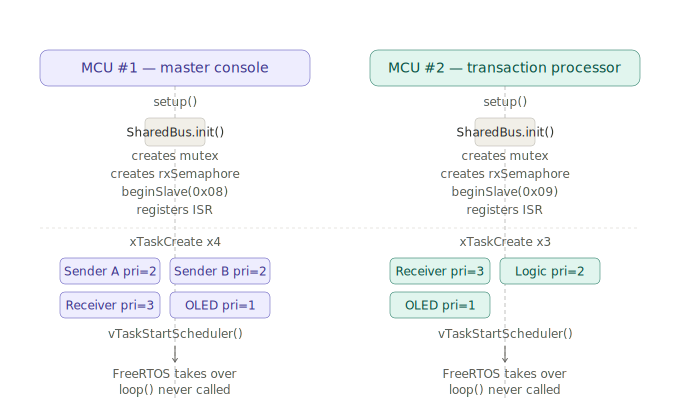
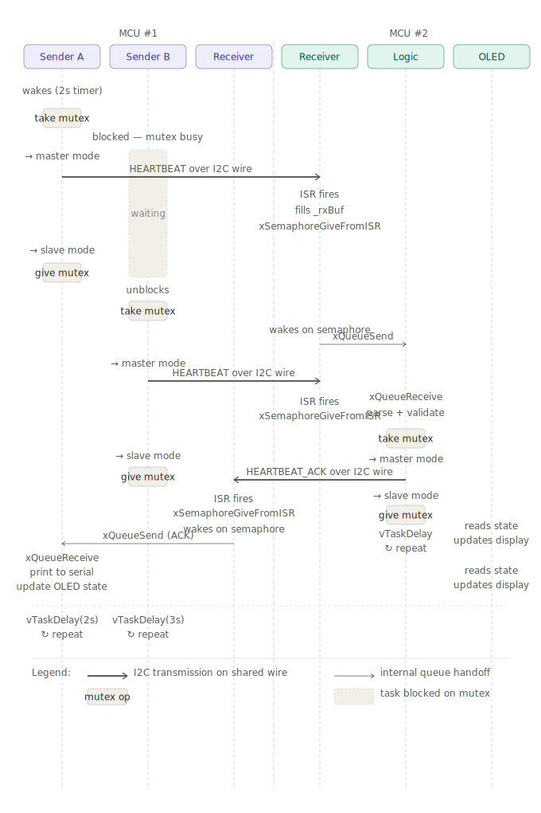
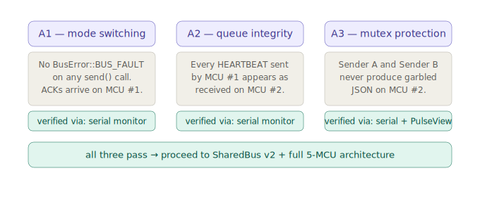

# PoC Sequence Diagrams

Three diagrams cover the full PoC flow. Read them in order.

---

## Diagram 1 — Boot sequence

Both MCUs go through identical boot steps. `SharedBus::init()` must complete
before any task is created, because the ISR is registered inside `init()` and
the `rxSemaphore` it signals must already exist. `vTaskStartScheduler()` hands
control to FreeRTOS — `loop()` is never called.

---

## Diagram 2 — Send / receive flow

The core of the PoC. Sender A and Sender B on MCU #1 run at different
intervals (2s and 3s) so they occasionally try to send simultaneously — this
is what stress-tests the mutex. The blocked task (dashed box) waits until the
mutex is released before proceeding.

Every I2C transmission is a thick dark arrow crossing the MCU boundary line.
Internal task handoffs via queue are thin grey arrows staying within one
MCU's column group. Mutex take/give operations are shown as small labelled
boxes on the lifeline.

---

## Diagram 3 — Pass / fail criteria

What constitutes a passing result for each assumption. All three must pass
before proceeding to Phase 3. A1 and A2 are verified via serial monitor alone.
A3 additionally requires a PulseView capture to confirm no overlapping
transactions appear on the wire.
